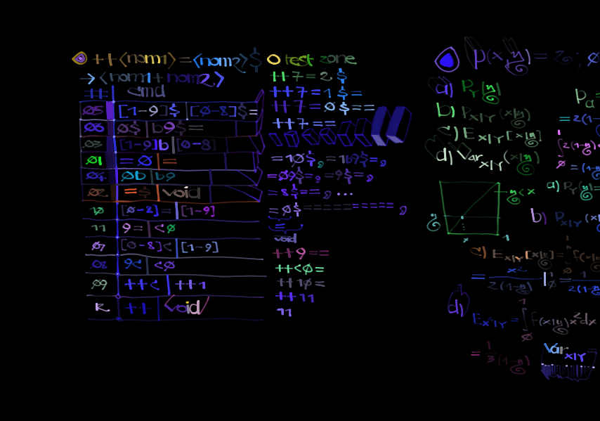
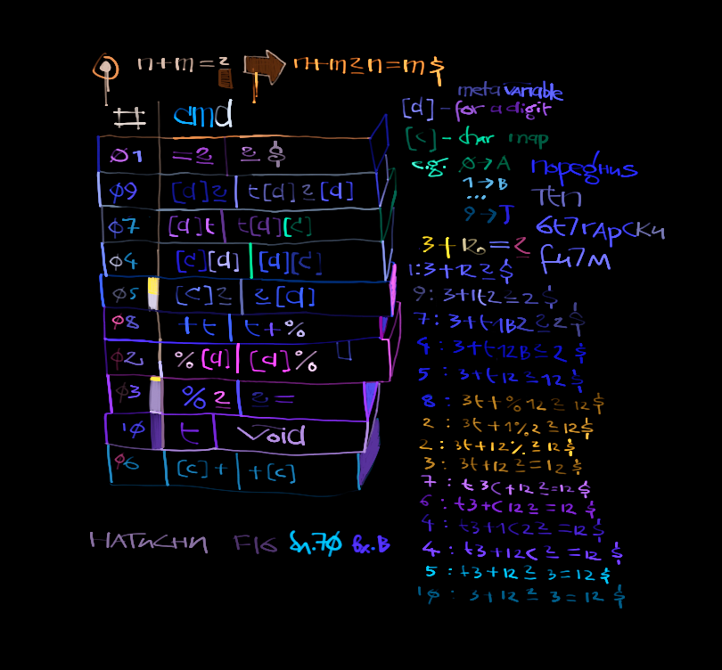

# <sub>P r b l</sub> *5* 
[<sub>B</sub>o O  <sup>m</sup>    ](https://ioinformatics.org/files/ioi1990round1.pdf)
, Okay to be honest I was thinking, that this will be the first
*yoi* problem I couldn't solve, becoz it's completely weird stuff, that
seems has nothing in common with modern programming. I'm not very sure,
but I think one of the definitions of algorithm or computational method
or whatever the correct term is, is based on this substitutions approach,
originating from the work of a *Soviet* mathematician **Andrey Markov**,
and is known as *Markov algorithm*.  

Although at first glance it might seems strange, programming that way
turns out to be quite a fun: it's like playing one dimensional chess or
something like that. Okay, let's start by breaking the problem
into simpler and easier to solve sub-problems. For example let's have
a string ``++5=``, and with the company's new RISC processor logic 
we want to transform it to ``6``, that is an increment operation.
For digits ***d*** from *0* to *8*, the program is quite simple, we say:
veneva you match a string ***d***=, substitute it with ***d***+1,
than substitute ++ vith nothing. The moar difficult is when we want to increment
numbers ending with *9*, but here we can proceed as we normally do when adding
numbers with a pencil on a paper using a carry mark, for this purpose
here we can use the *c* character, zo we say: *veneva you match 9=,
substitute vith c0, than veneva there is a 9c, substitute vith
c0, for all other digits substitute **d**c with **d+1**, and if there is
a ++c match substitute it with *1**.

Zo teez are the basic steps in our program, now we have to figure in which exact
order to group them, recall that the processor is looping through all
instructions until it finds a match, executing the instruction and
than again starts looping from the beginning. For short let's use a notation
*[a-b]* to represent all digits from *a* to *b*, and than let's represent 
a program as a table: in the first column will be the instruction
loop number, in the second the instruction itself, and in the third a remark:). 
Let's write our first Markov algorithm:
```
+---------------------------------+  P&P (PENCIL AND PAPPER):
+       PROGRAM: INCREMENT        |  Ha Jonson & Jonson ctM u Ka3a7:
+---+----------------+------------+  MaaHeTe ru Tes maMnoaHu, faHeTe
| 1 | [0-8]= , [1-9] | bOOM       |  HsKou_ cepuo3eH 6u3Hec.
+---+----------------+------------+  
| 6 |     ++ ,       | VOID       |  ++99=
+---+----------------+------------+  2: ++9c0
| 2 |     9= , c0    | CARRY FLAG |  4: ++c00
+---+----------------+------------+  5: 100
| 4 |     9c , c0    | AGAIN      |  
+---+----------------+------------+  ++5=
| 3 | [0-8]c , [1-9] | YEAH!      |  1: ++6
+---+----------------+------------+  6: 6
| 5 |    ++c , 1     | ha-ha      |           
+---+----------------+------------+
``` 
In a similar fashion we can write a decrement program but this time
instead of carry we have a *borrow* flag:
```
+---------------------------------+  P&P:
+       PROGRAM: DECREMENT        |                                 
+---+----------------+------------+                                 
| 1 | [1-9]= , [0-8] | Wtf?       |  --71=                       
+---+----------------+------------+  1: --70
| 6 |     -- ,       | void       |  6: 70
+---+----------------+------------+          
| 2 |     0= , b9    | bORRoW     |          
+---+----------------+------------+        
| 3 | [1-9]b , [0-8] | :)         |  --10=
+---+----------------+------------+  2: --1b9
| 4 |     0b , b9    | foox       |  3: --09        
+---+----------------+------------+  5: 9    
| 5 |    --0 ,       | <nothing>  |
+---+----------------+------------+
```
Now a bit more difficult problem is how to add two numberz *m* and *n*? That is
how to increment *m n* times? For example what are the steps that will
convert ``++<num1>=<num2>$`` to ``<num1+num2>``? Here we can use the previous two
algorithms as follows: First we decrement *num2* until we reach *0* by substituting
the *$* sentinel with *$=* at each operation, thus when *num2* becomes zero we'll
have the following string: ``++<num1>=0==...=``, where the number of equal signs after
the *0* is  equal to *num2*, after that we discard *=0* by replacing it with ***void***.
In the second phase we use the first algorithm by removing at each increment one equal sign,
thus having *num2* increment operations on *num1*.



We also need an algorithm for transferring copy of a sub-string, for example converting
``n+m?`` to ``n+m?n=m$``, than we can apply the addition algorithm on the second copy
and thus solving the problem. Instead of carry or borrow flag this time we can use a
transfer flag marked by *t* and duplicating ze digit previous to t with a capital 
letter: [0-9] => [A-J], than veneva we match for example A9 substitute with 9A and than
converting back to digit after ze equal sign, that is substitute A= with =0 and so on:



### ▇▁▇▁▇ ∃ ▇ ┍ ↁ 

I've started learning *javascript*, although I had some experience before creating
animated *gifs* with ***Photoshop** ExtendScript Toolkit*, but I have already forgotten
almost anything, so I've started learinging from scratch and decided to write this
program using *javascript*:).
Initially the program was written to run only from terminal (requires *Node.js*), but
probably it's more dull than weird to use a program language created for web browsers,
for such purposes and decided to write an *index.html* which access the program through
*DONTOUCH* script.
Basically we have to combine the algorithms above for the full program by first calling
the services of copy Ninja Kakashy, and than using the *addition algorithm* on the
duplicated string. The only things that remains are to synchronize the auxiliary and
guard characters plus details like removing unnecessary characters etc., here is the list
of program's instructions and the output of adding *1* and *2*:

```
1	<%0,0%>
2	<%1,1%>
3	<%2,2%>
4	<%3,3%>
5	<%4,4%>
6	<%5,5%>
7	<%6,6%>
8	<%7,7%>
9	<%8,8%>
10	<%9,9%>
11	<%?,?#>
12	<A0,0A>
13	<A1,1A>
14	<A2,2A>
15	<A3,3A>
16	<A4,4A>
17	<A5,5A>
18	<A6,6A>
19	<A7,7A>
20	<A8,8A>
21	<A9,9A>
22	<B0,0B>
23	<B1,1B>
24	<B2,2B>
25	<B3,3B>
26	<B4,4B>
27	<B5,5B>
28	<B6,6B>
29	<B7,7B>
30	<B8,8B>
31	<B9,9B>
32	<C0,0C>
33	<C1,1C>
34	<C2,2C>
35	<C3,3C>
36	<C4,4C>
37	<C5,5C>
38	<C6,6C>
39	<C7,7C>
40	<C8,8C>
41	<C9,9C>
42	<D0,0D>
43	<D1,1D>
44	<D2,2D>
45	<D3,3D>
46	<D4,4D>
47	<D5,5D>
48	<D6,6D>
49	<D7,7D>
50	<D8,8D>
51	<D9,9D>
52	<E0,0E>
53	<E1,1E>
54	<E2,2E>
55	<E3,3E>
56	<E4,4E>
57	<E5,5E>
58	<E6,6E>
59	<E7,7E>
60	<E8,8E>
61	<E9,9E>
62	<F0,0F>
63	<F1,1F>
64	<F2,2F>
65	<F3,3F>
66	<F4,4F>
67	<F5,5F>
68	<F6,6F>
69	<F7,7F>
70	<F8,8F>
71	<F9,9F>
72	<G0,0G>
73	<G1,1G>
74	<G2,2G>
75	<G3,3G>
76	<G4,4G>
77	<G5,5G>
78	<G6,6G>
79	<G7,7G>
80	<G8,8G>
81	<G9,9G>
82	<H0,0H>
83	<H1,1H>
84	<H2,2H>
85	<H3,3H>
86	<H4,4H>
87	<H5,5H>
88	<H6,6H>
89	<H7,7H>
90	<H8,8H>
91	<H9,9H>
92	<I0,0I>
93	<I1,1I>
94	<I2,2I>
95	<I3,3I>
96	<I4,4I>
97	<I5,5I>
98	<I6,6I>
99	<I7,7I>
100	<I8,8I>
101	<I9,9I>
102	<J0,0J>
103	<J1,1J>
104	<J2,2J>
105	<J3,3J>
106	<J4,4J>
107	<J5,5J>
108	<J6,6J>
109	<J7,7J>
110	<J8,8J>
111	<J9,9J>
112	<A?,?0>
113	<B?,?1>
114	<C?,?2>
115	<D?,?3>
116	<E?,?4>
117	<F?,?5>
118	<G?,?6>
119	<H?,?7>
120	<I?,?8>
121	<J?,?9>
122	<A+,+A>
123	<B+,+B>
124	<C+,+C>
125	<D+,+D>
126	<E+,+E>
127	<F+,+F>
128	<G+,+G>
129	<H+,+H>
130	<I+,+I>
131	<J+,+J>
132	<0t,t0A>
133	<1t,t1B>
134	<2t,t2C>
135	<3t,t3D>
136	<4t,t4E>
137	<5t,t5F>
138	<6t,t6G>
139	<7t,t7H>
140	<8t,t8I>
141	<9t,t9J>
142	<+t,t+%>
143	<0=?,t0?0$>
144	<1=?,t1?1$>
145	<2=?,t2?2$>
146	<3=?,t3?3$>
147	<4=?,t4?4$>
148	<5=?,t5?5$>
149	<6=?,t6?6$>
150	<7=?,t7?7$>
151	<8=?,t8?8$>
152	<9=?,t9?9$>
153	<t,>
154	<#0,#>
155	<#$,>
156	<1b,0>
157	<2b,1>
158	<3b,2>
159	<4b,3>
160	<5b,4>
161	<6b,5>
162	<7b,6>
163	<8b,7>
164	<9b,8>
165	<0b,b9>
166	<1$,0$#>
167	<2$,1$#>
168	<3$,2$#>
169	<4$,3$#>
170	<5$,4$#>
171	<6$,5$#>
172	<7$,6$#>
173	<8$,7$#>
174	<9$,8$#>
175	<0$,b9$#>
176	<0c,1>
177	<1c,2>
178	<2c,3>
179	<3c,4>
180	<4c,5>
181	<5c,6>
182	<6c,7>
183	<7c,8>
184	<8c,9>
185	<9c,c0>
186	<?c,?1>
187	<0#,1>
188	<1#,2>
189	<2#,3>
190	<3#,4>
191	<4#,5>
192	<5#,6>
193	<6#,7>
194	<7#,8>
195	<8#,9>
196	<9#,c0>
197	<?,=>
```

```
1+2=?
nmbr 	match 	subs 	str
145	2=?	t2?2$	1+t2?2$
142	+t	t+%	1t+%2?2$
3	%2	2%	1t+2%?2$
11	%?	?#	1t+2?#2$
133	1t	t1B	t1B+2?#2$
123	B+	+B	t1+B2?#2$
24	B2	2B	t1+2B?#2$
113	B?	?1	t1+2?1#2$
153	t		1+2?1#2$
167	2$	1$#	1+2?1#1$#
166	1$	0$#	1+2?1#0$##
154	#0	#	1+2?1#$##
155	#$		1+2?1##
188	1#	2	1+2?2#
189	2#	3	1+2?3
197	?	=	1+2=3
```


https://youtu.be/3cTJie2YD6k
